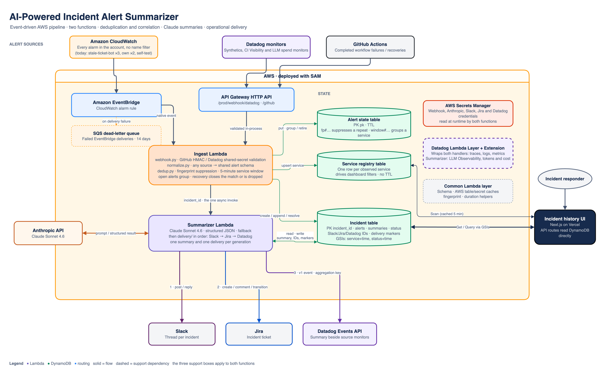

# ai-incident-summarizer

An AI-powered incident summarization system that ingests alerts from multiple observability sources, deduplicates and correlates them, summarizes incidents using an LLM, and delivers operational summaries to Slack, Jira, and back into Datadog's event timeline.

Built with AWS Lambda (Python), SAM, DynamoDB, Claude, Next.js, and Vercel.

**Live dashboard:** [incidents.hihelloreid.com](https://incidents.hihelloreid.com)

---

## Alert sources

| Source | Role | Integration |
|---|---|---|
| **CloudWatch** | Every alarm in the AWS account. The EventBridge rule matches `CloudWatch Alarm State Change` with no alarm-name filter, so an alarm feeds this pipeline the moment it exists; there is nothing to wire per alarm. Today that is the three `stale-ticket-bot-*` alarms, this stack's two own alarms and its self-test alarm (see below) | Native EventBridge |
| **Datadog** | Synthetics uptime and TLS checks, CI Visibility (deploy and pipeline failures) and the LLM spend monitors; see `scripts/wire_datadog_monitors.py` for the exact set | Webhook via API Gateway |
| **GitHub Actions** | CI/CD pipeline failures — only `workflow_run.completed` events; a failed run opens an incident, a successful one is a recovery that closes it; in-progress runs, `workflow_job` and `push` deliveries are ignored | Webhook via API Gateway |

**How the CloudWatch source is fed (RC1-435).** The rule is account-wide, so
the set of alarms that can open an incident is `aws cloudwatch describe-alarms`,
not anything in this repo. As of 2026-09-13 that set is:

| Alarm | Owner | What it means here |
|---|---|---|
| `stale-ticket-bot-lambda-errors` | stale-ticket-bot stack | Production source. Opened one incident per weekday 2026-09-03 to 2026-09-11 (INC-76, 77, 88, 91, 93, 94, 96), each delivered to Slack, Jira and Datadog and closed by the alarm's own recovery 18 minutes later. That is the live proof of the path. |
| `stale-ticket-bot-dlq-depth`, `stale-ticket-bot-missing-invocation` | stale-ticket-bot stack | Production sources; no state change since 2026-07-09 |
| `ai-incident-summarizer-summarizer-errors-high` | this stack | Production source. Unhandled error in the summarizer function. Ingest writes the incident either way; delivery to Slack/Jira/Datadog needs the summarizer, so check the dashboard if the thread never appears |
| `ai-incident-summarizer-ingest-dlq-depth-high` | this stack | Production source. EventBridge could not deliver an alarm event to ingest; the event is in `IngestDLQ` |
| `ai-incident-summarizer-test-alarm` | this stack | **Self-test only.** Alarms on the ingest function's own `Errors`, so a real ingest failure would try to report itself through the failing function. Flip it with `set-alarm-state` to verify the EventBridge rule; it is not a production source |
| `BillingAlarm` | account, 2022 | Dormant (`INSUFFICIENT_DATA` since 2022) |

The normalizer names the affected service after the alarm's first metric
dimension, reduced to the CloudFormation stack when the value is a generated
physical name (`stale-ticket-bot-StaleTicketBotFunction-G8cd3Ax5XBMd` →
`stale-ticket-bot`, `ai-incident-summarizer-IngestDLQ-CHgswNqI8tXR` →
`ai-incident-summarizer`; any other value is kept as is, and an alarm with no
dimensions uses its own name). Severity comes from a keyword in the alarm name,
defaulting to `high` in `ALARM` and `low` in `OK`.

---

## Architecture



Two Lambda functions (RC1-431):

- **Ingest** has two triggers: the HTTP API for the GitHub Actions and Datadog webhooks, and the EventBridge rule for CloudWatch alarm state changes. It authenticates the webhook (GitHub HMAC, Datadog shared-secret header), normalizes any source to one alert schema, suppresses duplicates by fingerprint, groups alerts for a service inside a 5-minute window into one incident (or, for a recovery, closes the matching open incident), writes the incident, and hands its ID to the summarizer with one asynchronous invoke.
- **Summarizer** reads the incident, asks Claude for a structured summary (or writes a deterministic fallback), then runs the delivery chain in order: Slack thread, Jira ticket, Datadog event. Each stage writes its artifact ID back to the incident and records the generation it delivered, so a retried invocation resumes where it stopped rather than posting again.

State is DynamoDB: one TTL-gated alert-state table (`fp#` rows that suppress a repeated alert, `window#` rows that group a service's alerts for 5 minutes), the incident table, and a service registry the dashboard's filters read. The Next.js incident history UI on Vercel reads the incident table and registry directly. `docs/architecture.drawio` is the source of the diagram.

### DynamoDB incident schema

| Field | Description |
|---|---|
| `incident_id` (PK) | Unique incident identifier |
| `source_alerts[]` | Per-alert summaries (id, source, name, severity, status, received_at; `monitor_id` for Datadog alerts) |
| `affected_service` | Service name |
| `severity` | critical / high / medium / low |
| `status` | open / acknowledged / resolved — set to `resolved` by the recovery of an alert the incident holds (CloudWatch OK, Datadog Recovered, GitHub success) |
| `resolved_at` | ISO timestamp of the recovery |
| `recovery_summary` | LLM-generated closing note (same three fields as `llm_summary`) |
| `llm_summary` | LLM-generated summary while open |
| `slack_thread_id` | Enables Slack reply threading |
| `jira_ticket_id` | Linked Jira ticket |
| `datadog_event_id` | Latest Datadog event posted for this incident (all its events share `aggregation_key` `incident:<id>`) |
| `recurrence` | Present when the same alert opened other incidents for this service in the last 7 days (RC1-437): `count_7d`, `previous_incident_id`, `previous_created_at`, `previous_jira_ticket_id` when it had one. Ingest computes it from `service-created-index` at creation; the summary prompt, the Slack header ("7th time in 7 days (previous: INC-96)"), the Jira title and description, and the Datadog event tag `recurrence_7d` all read it. Derived data: a lookup failure leaves it out and the incident is still written. |
| `created_at` | ISO timestamp |
| `ttl` | Optional expiry timestamp. TTL is enabled on the table, so any incident carrying this attribute is deleted by DynamoDB once it passes. Neither the pipeline nor the seed script sets it — omit it unless you want the incident to disappear. |

**GSIs:**
- `service-created-index` — query all incidents for a given service
- `status-created-index` — query all open incidents

---

## Project structure

```
ai-incident-summarizer/
├── template.yaml              # SAM template: two functions, three tables, the HTTP API, the EventBridge rule
├── README.md
├── CLAUDE.md                  # conventions, one page
├── docs/                      # architecture.drawio + the exported PNG
├── events/                    # Sample payloads for `sam local invoke`
│   ├── cloudwatch.json
│   ├── datadog.json
│   └── github-actions.json
├── functions/
│   ├── ingest/                # HTTP API + EventBridge → one incident hand-off
│   │   ├── app.py             # routes by event shape; the async invoke of the summarizer
│   │   ├── webhook.py         # GitHub HMAC / Datadog shared-secret validation
│   │   ├── normalize.py       # any source → the shared alert schema
│   │   ├── dedup.py           # fingerprinting, time-window grouping, recovery close
│   │   └── requirements.txt
│   └── summarizer/            # Claude summary, then the delivery chain
│       ├── app.py             # prompt, model call, fallback, per-stage delivery markers
│       ├── delivery/          # slack.py, jira.py, datadog_events.py — in that order
│       └── requirements.txt
├── layers/
│   └── common/                # Shared Lambda layer
│       └── python/
│           └── common/
│               ├── schema.py       # Normalized alert schema
│               ├── aws.py          # DynamoDB table + Secrets Manager caches
│               ├── fingerprint.py  # SHA-256 alert identity
│               └── duration.py     # human-readable incident duration
├── evals/                     # the billed agent-evals subject (incident-summary)
├── scripts/                   # Datadog webhook + monitor wiring, dashboard seed, registry backfill
├── frontend/                  # Next.js incident history UI, deployed to Vercel
└── tests/
    ├── unit/
    └── integration/           # moto-backed DynamoDB
```

## Prerequisites

- [AWS CLI](https://aws.amazon.com/cli/) configured (`aws configure`)
- [AWS SAM CLI](https://docs.aws.amazon.com/serverless-application-model/latest/developerguide/install-sam-cli.html)
- Python 3.14+
- A Datadog account with API key stored in AWS Secrets Manager
- A Slack app with `chat:write` and `chat:write.public` scopes
- A Jira API token

---

## Environment variables

Set by `template.yaml`; the SAM parameters in `samconfig.toml` supply the values.

| Variable | Function | Description |
|---|---|---|
| `GITHUB_WEBHOOK_SECRET_ARN`, `DATADOG_WEBHOOK_SECRET_ARN` | ingest | Secrets Manager ARNs for the webhook secrets |
| `ALERT_STATE_TABLE_NAME`, `SERVICE_REGISTRY_TABLE_NAME` | ingest | The alert-state (fingerprint + window) and registry tables |
| `CORRELATION_WINDOW_MINUTES` | ingest | Alert grouping window (5) |
| `SUMMARIZER_FUNCTION_NAME` | ingest | The one async hand-off |
| `INCIDENT_TABLE_NAME` | both | DynamoDB incident table |
| `ANTHROPIC_API_KEY_SECRET_ARN`, `MODEL_ID` | summarizer | The Claude call |
| `SLACK_BOT_TOKEN_SECRET_ARN`, `SLACK_CHANNEL_ID` | summarizer | Slack delivery |
| `JIRA_API_TOKEN_SECRET_ARN`, `JIRA_BASE_URL`, `JIRA_PROJECT_KEY`, `JIRA_USER_EMAIL` | summarizer | Jira delivery |
| `INCIDENT_DASHBOARD_URL` | summarizer | Linked from Datadog events (empty omits the link) |
| `DD_API_KEY_SECRET_ARN`, `DD_*`, `POWERTOOLS_SERVICE_NAME` | both (Globals) | Datadog wrapper, tracing and LLM Observability; the Datadog events writer reuses the same key |

### Dashboard access to DynamoDB (Vercel OIDC, RC1-220)

The Next.js API routes on Vercel read the incident and registry tables
directly. They do it as `DashboardReadRole`, defined in `template.yaml` next to
the tables it may read, and they get credentials for it by exchanging the
short-lived OIDC token Vercel injects into every invocation
(`VERCEL_OIDC_TOKEN`) with STS. There is no IAM user and no static access key
anywhere: the role's trust policy accepts tokens from this Vercel team and
project only, for the `production` and `development` environments. Preview
deployments are excluded on purpose, so a branch cannot read production data.

Requirements on the Vercel side, once:

- Project settings → Security → **Secure Backend Access with OIDC Federation**
  enabled, issuer mode *Team* (the trust policy expects
  `https://oidc.vercel.com/<team-slug>`).
- Environment variables for Production and Development: `AWS_ROLE_ARN` (the
  `DashboardReadRoleArn` stack output), `AWS_REGION`, `INCIDENT_TABLE_NAME`,
  `SERVICE_REGISTRY_TABLE_NAME`, plus the `NEXT_PUBLIC_SLACK_CHANNEL_ID` and
  `NEXT_PUBLIC_JIRA_BASE_URL` links. No `AWS_ACCESS_KEY_ID` or
  `AWS_SECRET_ACCESS_KEY`; if they are present the SDK still prefers the
  explicit provider, but they should not exist.

Granting the dashboard a new table is a template change to
`DashboardReadRole`'s policy, reviewed in the same PR as the table. RC1-218
failed at runtime with a 500 because the old inline policy lived only in the
console.

## Local development

```bash
# Build
sam build

# Run a function locally with a sample event
sam local invoke IngestFunction --event events/cloudwatch.json

# Deploy to AWS
sam deploy --guided
```

Frontend:

```bash
cd frontend
vercel link                           # once; picks the ai-incident-summarizer project
vercel env pull .env.local --yes      # env vars + a VERCEL_OIDC_TOKEN good for ~12 h
npm run dev
```

The OIDC token in `.env.local` expires after about 12 hours. The symptom is an
STS or DynamoDB credentials error from the API routes, not an obvious expiry
message; re-run `vercel env pull .env.local --yes`. The pull rewrites the whole
file, so keep hand-added variables in `.env.development.local` instead. The
Python scripts under `scripts/` use a normal AWS profile through boto3 and are
unaffected.

---

## Seeding the incident dashboard

To populate the incident history UI with realistic demo data:

```bash
pip install boto3

DYNAMODB_TABLE=<table-name> AWS_DEFAULT_REGION=us-east-1 python scripts/seed_dynamo.py
```

Get the table name from the stack outputs:

```bash
aws cloudformation describe-stacks --stack-name ai-incident-summarizer \
  --query "Stacks[0].Outputs[?OutputKey=='IncidentTableName'].OutputValue" \
  --output text
```

The script seeds 90 incidents across 10 services (payments, auth, API gateway, notifications, search, billing, users, CDN, data pipeline, WebSocket) with a mix of open, resolved, and acknowledged statuses. Re-running the script is safe — it upserts by `incident_id` and does not create duplicates.

---

## Webhook endpoints

After `sam deploy`, retrieve the base URL from stack outputs:

```bash
aws cloudformation describe-stacks --stack-name ai-incident-summarizer \
  --query "Stacks[0].Outputs[?OutputKey=='WebhookApiUrl'].OutputValue" \
  --output text
```

| Source | Endpoint |
|---|---|
| GitHub Actions | `POST <WebhookApiUrl>/webhook/github` |
| Datadog | `POST <WebhookApiUrl>/webhook/datadog` |

`WebhookApiUrl` ends in the API stage (`/prod`). A URL without it returns `404 {"message":"Not Found"}` from API Gateway itself, with nothing in the receiver's logs — the symptom to look for when a webhook "sends but nothing arrives".

**Datadog payload template.** The webhook definition lives in Datadog, so `scripts/configure_datadog_webhook.py` is the source of truth for what it sends: the monitor id (`$ALERT_ID`), tags as one comma-separated string, `$ALERT_PRIORITY`, `$ALERT_TYPE`, `$ALERT_TRANSITION` and the event link, on top of Datadog's default fields. Datadog's default template carries none of those, and the normalizer needs them for service, severity, status and the `monitor_id:` tag on the written-back event (RC1-370). Re-run the script if the webhook is recreated:

```bash
DD_API_KEY=… DD_APP_KEY=… python scripts/configure_datadog_webhook.py
```

To notify the pipeline, add `@webhook-incident-summarizer` to a monitor's message. Monitor **318762066** ("incident-summarizer webhook test signal") exists for exactly that: push `incident_summarizer.test_signal` = 1 to trigger it, 0 to recover.

**Which real monitors notify it.** `scripts/wire_datadog_monitors.py` is the source of truth (RC1-375): nine monitors that mean a real outage and rarely flap — the five synthetics checks on www.hihelloreid.com and incidents.hihelloreid.com (uptime, /work render, TLS expiry), the two CI Visibility monitors (production deploy failed, CI pipeline failed) and the two LLM spend monitors (the daily guardrail and the cost-per-call price signal, RC1-377). Each gets the webhook handle appended to its message, a `service:` tag (`hihelloreid.com`, `incidents.hihelloreid.com`, `delivery-pipeline`, `agent-fleet`) so the incident is filed under a service rather than `unknown`, and a priority (P2 for the two uptime checks and the deploy monitor, P3 for the rest), since `$ALERT_PRIORITY` sets incident severity. The six Program KPI monitors and the seven host-pack monitors are deliberately left out — the KPI sim keeps a monitor tripped by script for weeks, and each alert would be a Slack post, an INC ticket and a model call. Synthetics-backed monitors reject monitor-API edits, so the script writes their message, tags and priority to the synthetics test instead. Re-run it after a monitor is recreated or edited by hand; it changes nothing that already matches:

```bash
DD_API_KEY=… DD_APP_KEY=… python scripts/wire_datadog_monitors.py --dry-run   # then without --dry-run
```

---

## Key design decisions

| Decision | Choice | Rationale |
|---|---|---|
| Runtime | Lambda (Python 3.14, Amazon Linux 2023) | Stateless, zero cost at idle, easy to deploy |
| Function count | Two: ingest, and summarize + deliver (RC1-431) | It began as seven, one per box, joined by five async invokes. The hops shared no failure domain worth isolating and cost retries that double-posted, seven copies of the layer pin and memory floor, and seven APM histories. The natural seams are the synchronous edge work and the asynchronous model-call-plus-delivery. |
| State management | DynamoDB TTL | Lambda is stateless; the transient state (fingerprints and correlation windows) lives in one TTL-gated table under `fp#` and `window#` keys (RC1-432), and the condition expressions test `ttl` themselves because the sweep is lazy |
| Secret management | AWS Secrets Manager | API keys never stored in plain text or env vars |
| Deployment | AWS SAM | Native AWS tooling, infrastructure-as-code |
| Observability | Datadog Lambda layer (ddtrace) + Extension | APM traces, logs and metrics auto-instrumented; the Claude call also reports to LLM Observability as ml_app `incident-summarizer` with tokens and cost (RC1-419). Same ddtrace as the rest of the fleet, switched on by `DD_LLMOBS_*` env vars instead of an `LLMObs.enable()` call and flushed through the extension rather than agentless, which would add a blocking flush to every invocation (RC1-445) |
| Recoveries | Close, never open | A resolved alert (CloudWatch OK, Datadog Recovered, GitHub success) closes the newest open incident for that service holding the same alert, retires the window and fingerprint rows so the next alert starts fresh, and runs the delivery chain once more with a `recovered` flag: Slack reply in the thread, Jira comment plus a Done-category transition when the workflow offers one, Datadog `success` event on the same aggregation key. A recovery with nothing to close is dropped. |
| Delivery chain | Slack → Jira → Datadog, in one function | The order is a sequencing constraint (the Datadog event carries both links), not a reason for three functions. Each stage is idempotent about its own artifact and records `<stage>_delivered_count`, so a Lambda retry of the summarizer resumes at the first unfinished stage instead of re-posting; a re-summary of a live incident (a new alert in the window) is a new generation and delivers again. |
| Datadog write-back | Events API v1, last stop in the delivery chain | The summary that came out of Datadog's alerts goes back in as an event, so the timeline shows it beside the raw monitors; `aggregation_key` rolls re-summaries and the recovery up under one row. Reuses the Lambda extension's API key secret — Datadog API keys carry no scopes, so there is no narrower key to mint. |
| Incident history UI | Next.js on Vercel | Next.js API routes call DynamoDB directly as Vercel serverless functions — no API Gateway needed. A single `vercel deploy` produces a shareable URL. React handles the dashboard UI. Chosen over a static S3 + API Gateway approach for simplicity and to gain practical exposure to Vercel, which is widely used in the industry. |

---

## Known limitations


**Datadog webhook signature verification**
Datadog's webhook integration does not support HMAC payload signing natively, unlike GitHub Actions which uses `X-Hub-Signature-256`. Instead, a shared secret is passed via a custom `X-Webhook-Secret` header configured in the Datadog webhook settings and stored in AWS Secrets Manager. The receiver validates the header value using a timing-safe comparison. This is Datadog's recommended approach for webhook authentication.

---

## Evals

The incident summary runs under the shared [agent-evals](https://github.com/snacksnack/agent-evals)
harness (RC1-267), in two layers:

- **Layer 1 — free, on every push.** `pytest` covers the prompt/parser
  contract: `_call_llm` parses the model's response with a bare `json.loads`,
  so the prompt's raw-three-field-JSON clauses are load-bearing. Editing them
  without keeping the contract fails CI instead of silently degrading
  production to the fallback summary.
- **Layer 2 — billed, deliberate.** `python -m evals` binds fixture incidents
  into the shipped prompt, calls the model `template.yaml` pins, and scores
  the output: the contract on real output, the handed-over facts, and that the
  model restates the computed severity rather than re-deciding it. Needs
  `ANTHROPIC_API_KEY` in the environment and
  `pip install -r requirements-evals.txt`.

Runs land in the shared store and render on the public
[quality trend page](https://snacksnack.github.io/agent-evals/) as subject
`incident-summary`; [docs/measuring.md](https://github.com/snacksnack/agent-evals/blob/main/docs/measuring.md)
is the runbook for taking a measurement end to end.

---

## Jira epic

This project is tracked under epic **RC1-31** at [hirereidcollins.atlassian.net](https://hirereidcollins.atlassian.net). The eval suite is RC1-267 under epic RC1-230.
